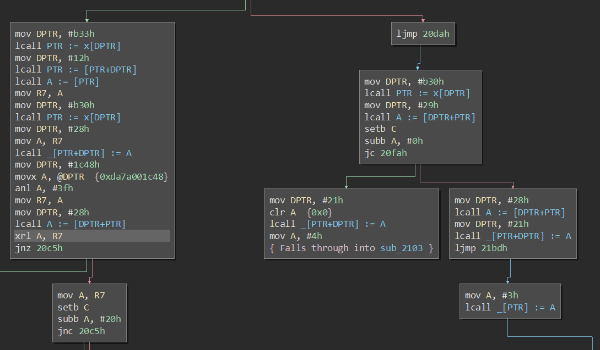
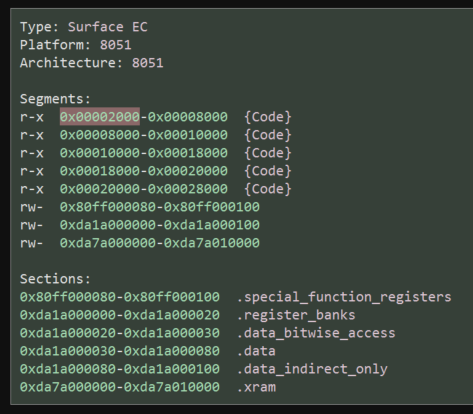
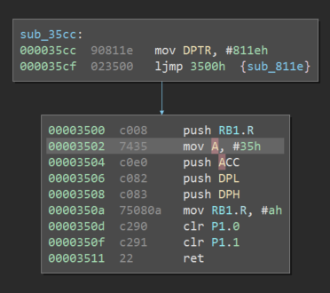
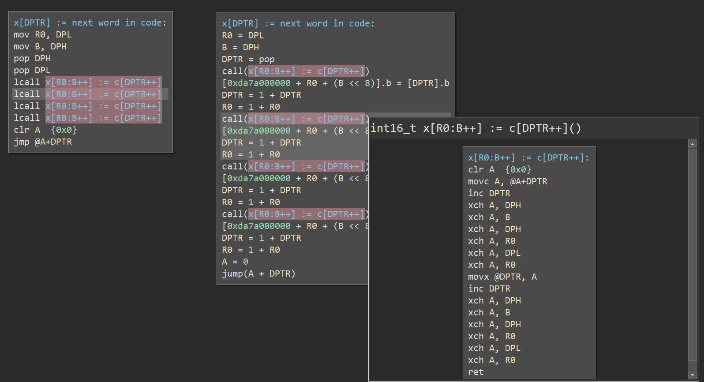

# Intel 8051 Family Architecture Plugin

This is a disassembler for a variety of _MCS-51_-based chips. It's fairly high-effort, and should (eventually) automatically do some things that are tedious elsewhere.

You _will_ need to write your own `BinaryView`, like the one in [devices/surface_ec.py](devices/surface_ec.py). It will need to do 3 things.

1. Act as a loader from whatever firmware update you're carving code from, and hopefully add in any missing ROM portions from your specific target device.

2. Patch in hardware-specific features such as flash page swapping via port registers. (And, eventually, any important special function register or reserved instruction extensions.) This is a little experimental and exact mechanics may still change, but should result in proper cross-references across address spaces.

3. Patch in analysis hints specific to the compiler used by the architecture. In terms of gigabytes of code that people would like to look at with Binary Ninja, 8-bit processors rank low, so this part will be a mess. However, if done correctly, it should give you access to all of Binary Ninja's existing IL-analysis goodness.

### Minimum Goal

Productivity parity with IDA, provided you're okay with writing code instead of manually fixing things.

I don't expect it will be outright better for anything "weird" (i.e. closely tied to hardware, not produced by a C compiler, or heavy on interpreting data) but it should be easier to scale analysis across multiple firmware versions on the same target. (Once someone else implements good diffing, anyway, which hasn't happened yet.)

This isn't a very ambitious goal, but Binary Ninja is still in early development and is still focused on mainstream userland code.

### Maximum Goal

There's a range of severity for RE tool failures:

1. No failure: code being analyzed is within the tool's service envelope.
2. Analysis failed but you are warned, and can go fix it by hand or with code.
3. Silent failure, but at least it was localized.
4. Failure cascaded into more failures, tool is outputting complete garbage.

Type 2 failures are a good idea, but I'm lazy and okay with type 3 failures. Type 2 failures in parts of the image that don't matter or can be reversed at a higher layer (FP math libs, HAL guts, early startup code, etc.) are just a distraction, and keeping warning false positive rates low takes effort.

I'd like to augment skilled users doing deep reverse engineering. Shallow findings reachable by automation or scanner-toting sweatshops are dull, so I don't care how many type 3 failures exist in the tool. I do want to avoid type 4 failures, especially if their output might get written to a database. 

In other words, the auto-analysis system ought to converge rather than diverge. Anything that introduces new code entry points either needs to be sound, or have a mechanism to detect garbage-markup that triggers an undo savepoint. If that's impossible, probably-broken analysis should generate warnings and be postponed pending manual review.

### Maximum Goal Reachability

Not yet sure. There's a lot of complex code interacting to get there, not all of it good, not all of it mine, not all of it with source. 

- Proving soundness of the lifter for relevant subsets of the architecture may not be enough if flag semantics are opaque. Specifying which subset of the architecture is truly relevant is non-trivial.
- Central reasoning about architecture assumptions scattered through different layers of the analysis toolchain will be hard, unless I can find good abstractions to refactor to and propagate assumption checks from. WIP.
